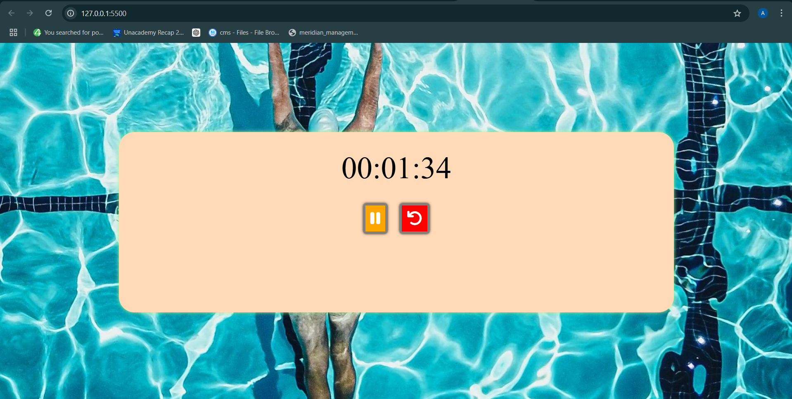

# ⏱️ Simple Stopwatch  

A lightweight and user-friendly stopwatch built using JavaScript. Start, pause, and reset the timer with a clean and simple UI. 🚀  

## 📌 Features  
- Start, pause, and reset functionality.  
- Minimalistic and responsive design.  
- Built with **HTML, CSS, and JavaScript**.  

## 🔥 Demo  
  

## 🛠️ Tech Stack  
- HTML  
- CSS  
- JavaScript  

## 🎯 How to Use  
1. Clone the repository:  
   ```sh
   git clone https://github.com/ashmita41/stop-watch.git
